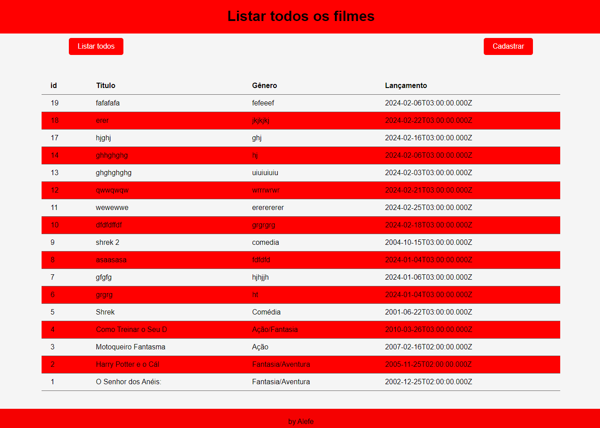
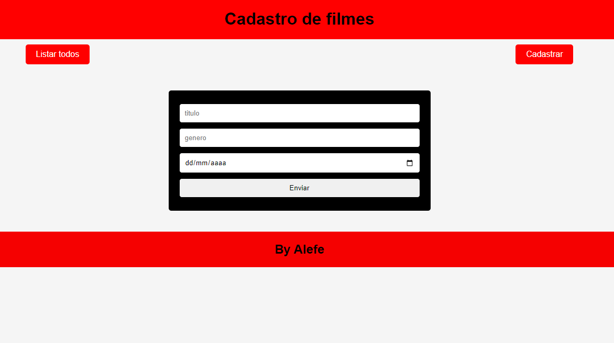
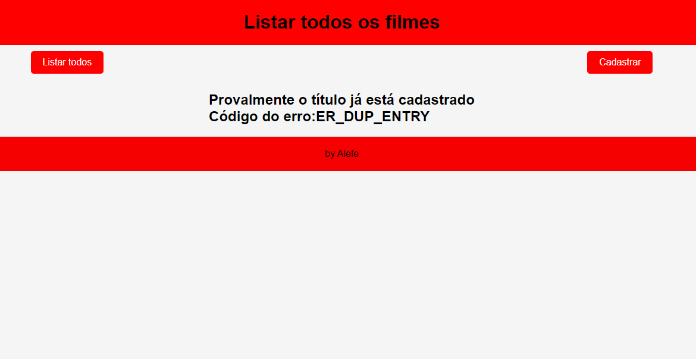

# Locadora
## Sistema fullstack de exemplo

## Tecnologias
- [NodeJS](https://nodejs.org/en/) - Ambiente de execução Javascript
- [VsCode](https://code.visualstudio.com/) - IDE
- [XAMPP](https://www.apachefriends.org/pt_br/index.html) - Mysql/MariaDB (XAMPP)
- Live Server - Extenção de servidor front-end VsCode para executar html

## Como testar
- 1 clone este repositório
- 2 Abra com VsCode
- 3 Abra o XAMPP e clique em Start no MySQL
- 4 Abra o banco de dados via shell ou phpMyadmin e rode o **script.sql** para criar e popular o banco de dados.
- 5 Abra o terminal (CMD ou BASH)

- 6 Execute o comado "mysql -u root" depois abra outro terminal cmd e fassa o comando npm i
```
- 7 Inicie o Back-End
```bash
node server.js
ou
nodemon
ou
npx nodemon
```
7 - Execute o index.html via Live Server.

# Prints das Telas



